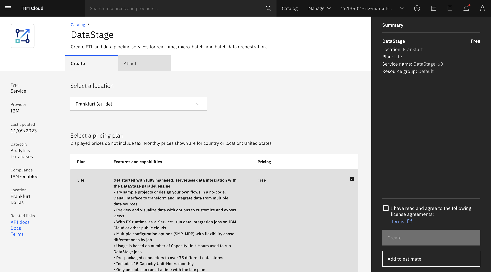
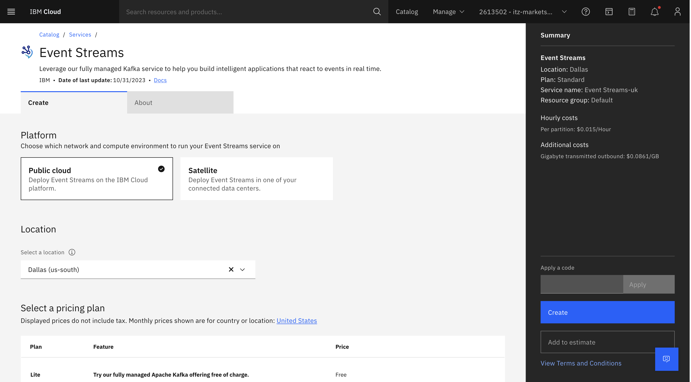
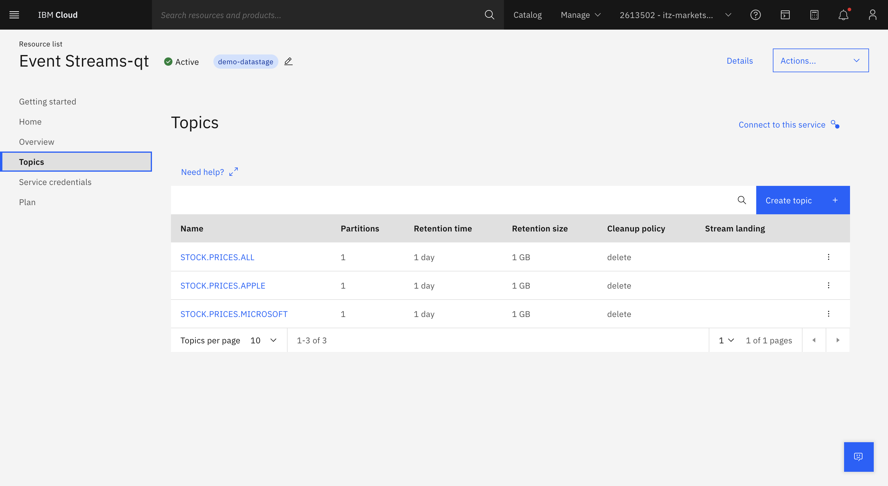
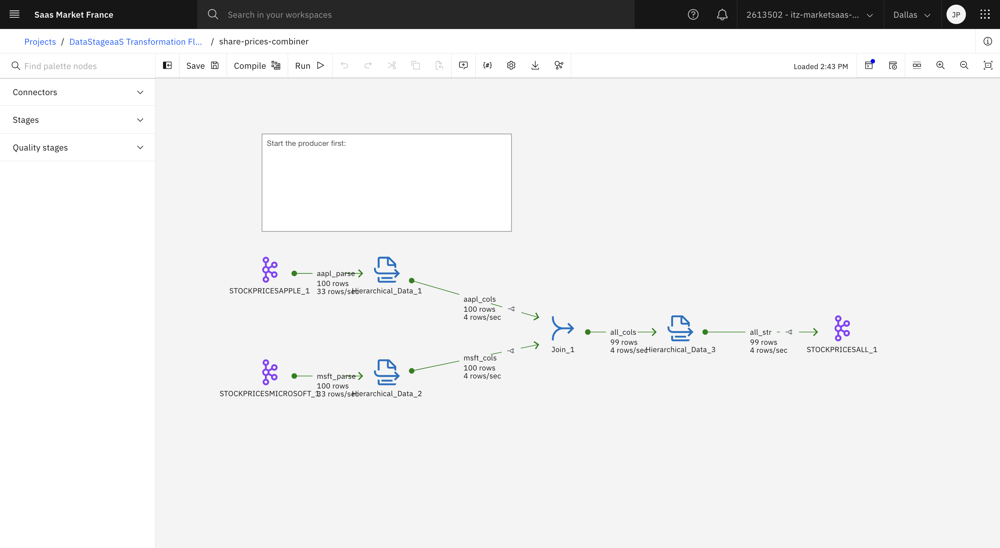
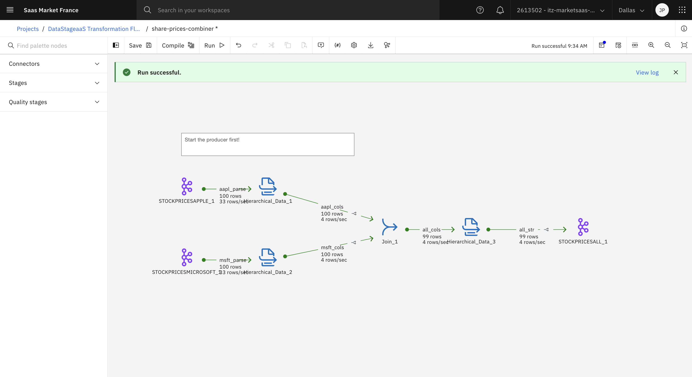
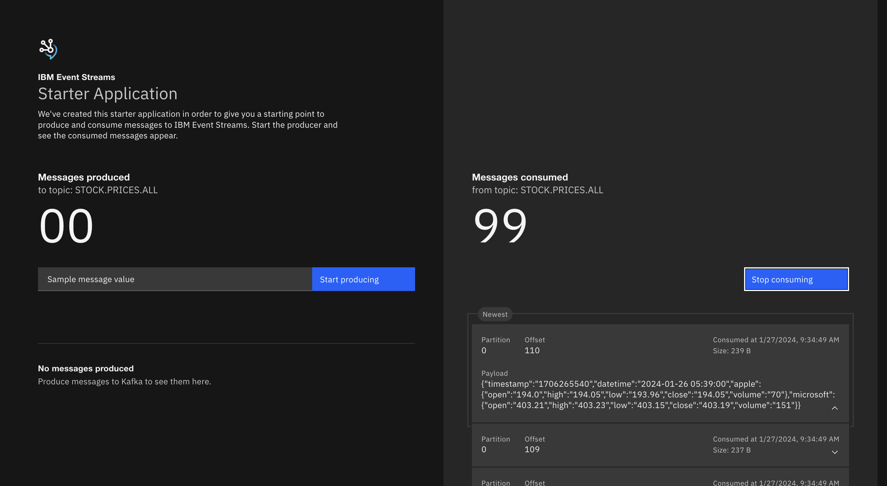

# kafka-datastage-demo
Demonstration script of the kafka connector within DataStage

I have come across [this nice tutorial](https://dalelane.co.uk/blog/?p=4740) from Dale Lane with a scenario to join two kafka topics into a third one.
However, one of the pre-requisite was some knowledge of [IBM Event Stream](https://www.ibm.com/products/event-streams). Because the tutorial was so nice, I have decided to spend a little bit of time and learn the basics around IBM Event Streams and kafka connect so I can replicate the Dale's tutorial.
<br>

If you don't have the time, here are the exact steps I followed:
1. [Setup Prerequisites](#setup-prerequisites)
2. [Streaming Stock Data to your IBM Event Streams instance](#streaming-stock-data-to-your-ibm-event-streams-instance)
3. [Running the DataStage tutorial](#running-the-datastage-tutorial)
<br>

### Setup Prerequisites

First, you need to access your [IBM Cloud account](https://cloud.ibm.com/) and provision both the DataStage Serber and the IBM Event Streams service.
<br>

Let's start with DataStage. Search for DataStage and provision the Lite Plan.


Continue with IBM Event Stream and search for IBM Event Streams.

Make sure you select the **Standard Plan** as the Lite Plan doesn't seem to allow you to create more than one topic.

Next access your newly provisionned IBM Event Streams console, and create 3 topics:
* STOCK.PRICES.APPLE
* STOCK.PRICES.MICROSOFT
* STOCK.PRICES.ALL



Then go back to the home page of your IBM Event Streams service and click on the Get Started card. Follow the instructions, when generating the properties file, make sure you select the existing topic STOCK.PRICES.ALL and create new credentials: 

If you pass this step, you should be viewing the following screen in your default browser:

 A few pre-requisites are needed on your desktop as well:
* install java@11 on your mac: brew install java11 and verify it
```
(base) pradier@juliens-mbp-2 images % java -version
openjdk version "11.0.21" 2023-10-17
OpenJDK Runtime Environment Homebrew (build 11.0.21+0)
OpenJDK 64-Bit Server VM Homebrew (build 11.0.21+0, mixed mode)
```
* install maven on your mac:  brew install maven and verify it
```
(base) pradier@juliens-mbp-2 images % mvn --version
Apache Maven 3.9.6 (bc0240f3c744dd6b6ec2920b3cd08dcc295161ae)
Maven home: /opt/homebrew/Cellar/maven/3.9.6/libexec
Java version: 21.0.1, vendor: Homebrew, runtime: /opt/homebrew/Cellar/openjdk/21.0.1/libexec/openjdk.jdk/Contents/Home
Default locale: en_FR, platform encoding: UTF-8
OS name: "mac os x", version: "14.2", arch: "aarch64", family: "mac"
```
* get a free api key from [Alpha Vantage site](https://www.alphavantage.co/)

You should be good to go.

### Streaming Stock Data to your IBM Event Streams instance 

It's time to follow Dale's nice [Stock connector tutorial](https://dalelane.co.uk/blog/?p=4463).
<br>
You can either clone [Dale's repo](https://github.com/dalelane/kafka-connect-stockprice-source) and simple clone this repo and move to the connector folder.
Then just build the package:
```
mvn package
```
Then you need to run the connector using [Kafka Connect](https://kafka.apache.org/documentation/#connect_user). That is what took me the longest time to figure out. Here are the steps:
1. Go to the Apache site [Apache Kafka site](https://kafka.apache.org/downloads) and download the latest stable binary
```
wget https://downloads.apache.org/kafka/3.6.1/kafka_2.12-3.6.1.tgz
```
2. untar it to your directory
```
tar xvzf kafka_2.12-3.6.1.tgz
```
3. write the connect-standalone-demo.properties from the connect-standalone-demo.properties, you will need to replace the values from those in the previously downloaded kafka.properties
```
bootstrap.servers=<YOUR BOOTSTRAP>
## Consumer specific properties
group.id=ibmeventstreams_starter_app_group
auto.offset.reset=earliest
enable.auto.commit=false
key.deserializer=org.apache.kafka.common.serialization.StringDeserializer
value.deserializer=org.apache.kafka.common.serialization.StringDeserializer
## Producer specific properties
acks=all
key.serializer=org.apache.kafka.common.serialization.StringSerializer
value.serializer=org.apache.kafka.common.serialization.StringSerializer
## Optional security options
security.protocol=SASL_SSL
ssl.protocol=TLSv1.2
sasl.jaas.config=<YOUR JAAS CONFIG>
sasl.mechanism=PLAIN
ssl.enabled.protocols=TLSv1.2
ssl.endpoint.identification.algorithm=HTTPS
## Optional security options for producer
consumer.security.protocol=SASL_SSL
consumer.ssl.protocol=TLSv1.2
consumer.sasl.jaas.config=<YOUR JAAS CONFIG>
consumer.sasl.mechanism=PLAIN
consumer.ssl.enabled.protocols=TLSv1.2
consumer.ssl.endpoint.identification.algorithm=HTTPS
## Optional security options for consumer
producer.security.protocol=SASL_SSL
producer.ssl.protocol=TLSv1.2
producer.sasl.jaas.config=<YOUR JAAS CONFIG>
producer.sasl.mechanism=PLAIN
producer.ssl.enabled.protocols=TLSv1.2
producer.ssl.endpoint.identification.algorithm=HTTPS

# The converters specify the format of data in Kafka and how to translate it into Connect data. Every Connect user will
# need to configure these based on the format they want their data in when loaded from or stored into Kafka
key.converter=org.apache.kafka.connect.storage.StringConverter
value.converter=org.apache.kafka.connect.storage.StringConverter
# Converter-specific settings can be passed in by prefixing the Converter's setting with the converter we want to apply
# it to
key.converter.schemas.enable=true
value.converter.schemas.enable=true

offset.storage.file.filename=/tmp/connect.offsets
# Flush much faster than normal, which is useful for testing/debugging
offset.flush.interval.ms=10000
plugin.path=<YOUR PATH>/kafka-connect-stockprice-source-0.0.3-jar-with-dependencies.jar
```
4. Write the two connector file properties, one for AAPL stocks, one for MSFT stocks, respectively, make sur you update the Vantage API key in the two files.  

5. run the connector to stream data to the STOCK.PRICES.APPLE and STOCK.PRICES.MICROSOFT topics.
```
kafka_2.12-3.6.1/bin/connect-standalone.sh connect-standalone-demo.properties stock-aapl-connector.properties stock-msft-connector.properties
```

### Running the DataStage tutorial

As I said earlier, the [DataStage tutorial](https://dalelane.co.uk/blog/?p%253D4740) is really nicely written. No need for me to replicate.
<br>
Access your DataStage instance and run the tutorial, you should end up with the following flow:

TIPS: use the two files [sample.json](sample.json) and [combined.json](combined.json) to setup your two schema libraries, also use the token for username and associate key for password when setting up the Kafka connector.
<br>

Then just run the flow, it should be successul and show a number of rows processed:


<br>
If you go back to the [Starter Application](http://localhost:8080/), it should show the same number of messages on the STOCK.PRICES.ALL topic.



***Big Thanks*** to Dale Lane for the original tutorial.